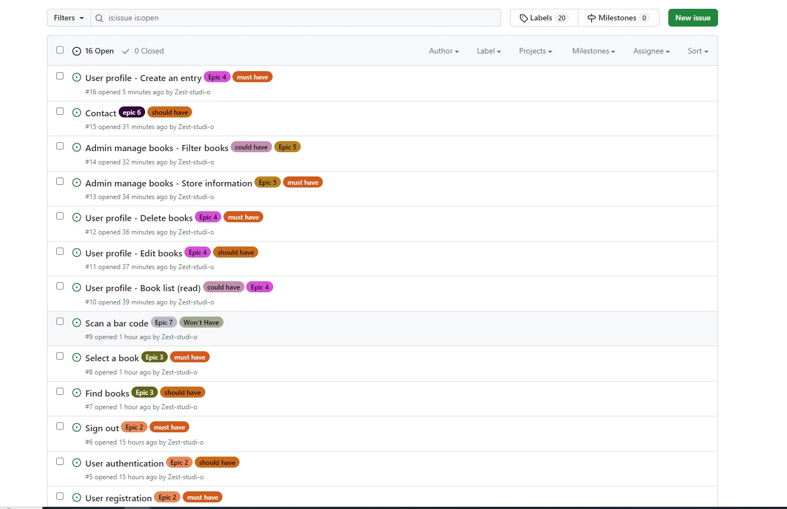
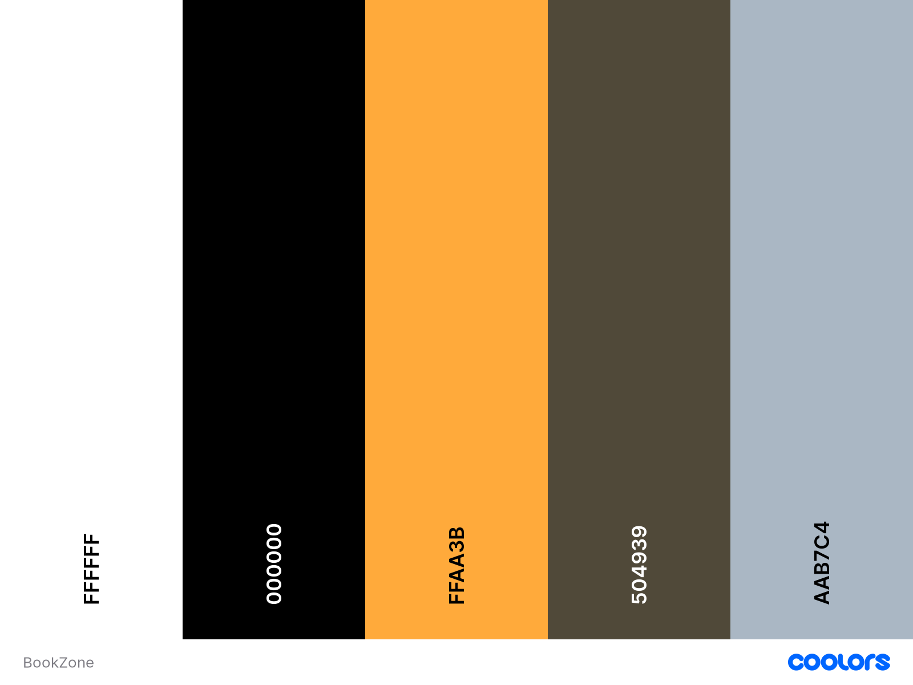
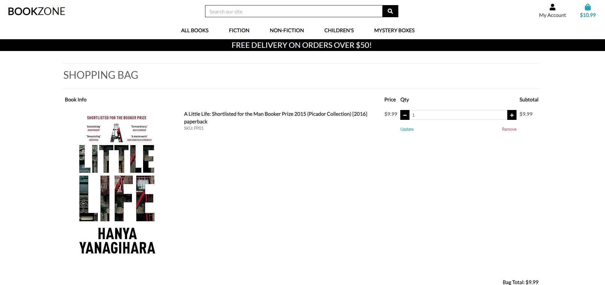
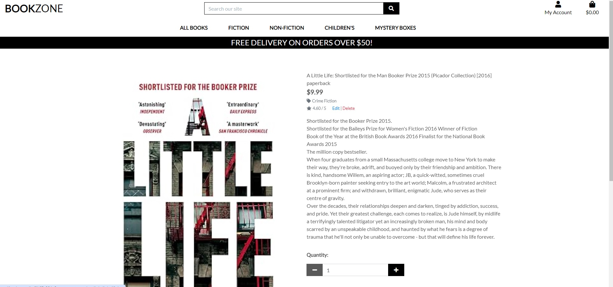
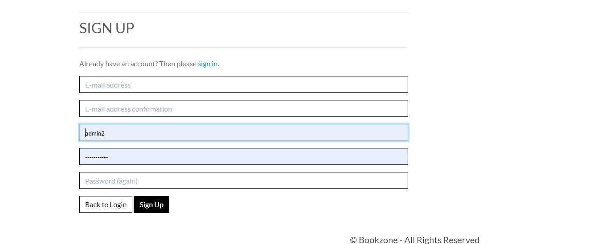
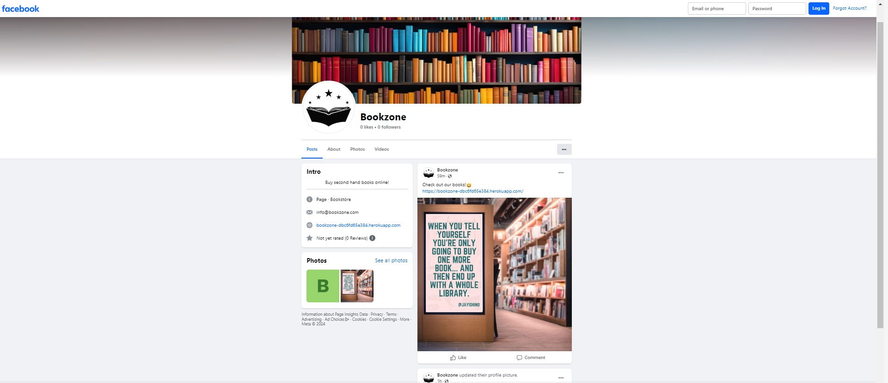
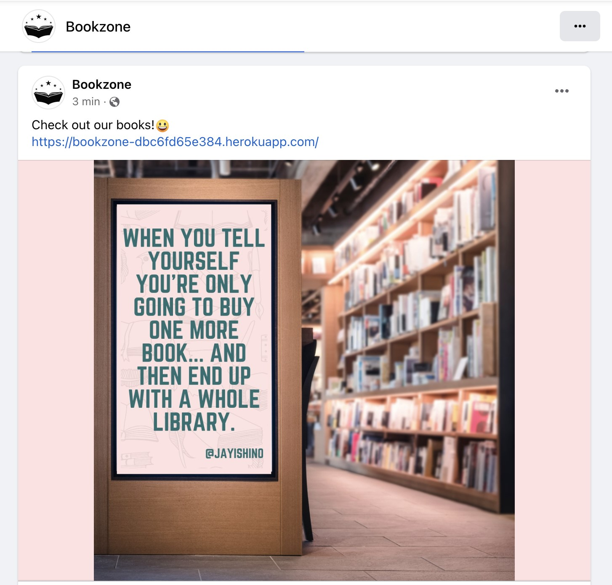
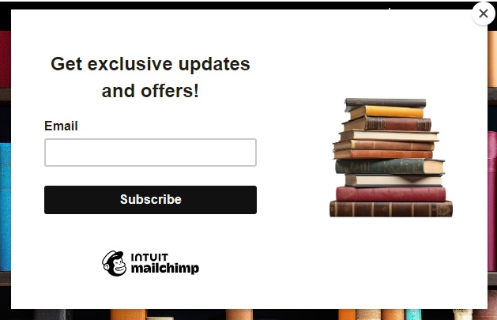

# BOOKZONE

A web application that enables users to sell, and buy second-hand books.

Visit the live site: [Bookzone](https://bookzone-dbc6fd65e384.herokuapp.com/)

# Table of contents

- [User Experience (UX)](#User-Experience-UX)
  - [User Stories](#User-Stories)

- [Agile Metodology](#Agile-metodology)

- [Design](#Design)

  - [Flowchart](#Flowchart)
  - [Database Schema](#Database-Schema)
  - [Colour Palette](#Colour-Palette)
  - [Typography](#Typography)
  - [Imagery](#Imagery)
  - [Wireframes](#Wireframes)
  - [Features](#Features)

- [Marketing Stategy](#Marketing-Stategy)
  - [Business model](#Business-model)
  - [Social Media](#Social-Media)
      - [Facebook](#Facebook)
  - [Newsletter](#Newsletter)
      - [Mailchimp](#Mailchimp)

- [Technologies Used](#Technologies-Used)

  - [Frameworks, Libraries & Programs Used](#frameworks-libraries--programs-used)

- [Deployment & Local Development](#Deployment--Local-Development)

  - [Deployment](#Deployment)
  - [Local Development](#Local-Development)
    - [How to Fork](#How-to-Fork)
    - [How to Clone](#How-to-Clone)

- [Testing](#Testing)

- [Credits](#Credits)
  - [Code Used](#code-used)
  - [Content](#content)
  - [Media](#media)
  - [Acknowledgments](#Acknowledgments)

---

## User Experience (UX)

#### Key information for the site

This section provides insight into the UX process, with a focus on the people who this e-commerce application shop has been created for, the main aims of the project and how it can help users to meet their needs.

Project goals:

- To encourage people to buy second-hand books by using the application.

- To provide an easy and user-friendly web app where users can buy books and know more.

- To provide a system where the product owner can manage books and interact with customers.

### User Stories

|   EPIC                                |ID|                                User Story                                                   |
| :-------------------------------------|--|:------------------------------------------------------------------------------------------- |
|**CONTENT AND NAVIGATION**             |  ||
|                                       |1A| As a user, I want to easily access all the content in the shop |             
|                                       |1B| As a user, I want to see relevant information about the books|
|                                       |1C| As a user, I want the website to have a nice and intuitive design that will match the shops's theme|
|**USER REGISTRATION/AUTENTHICATION**   |  || 
|                                       |2A| As a user, I want to be able to register on the website|
|                                       |2B| As a user, I want to be able to authenticate using only email and password|
|                                       |2C| As a user, I want to be able to log out at any time|
|**BOOKS**                            |  ||
|                                       |3A| As a logged-in user, I want to be able to find the available books to buy |
|                                       |3B| As a logged-in user, I want to be able to select the book I want to buy|                                  
|**USER PROFILE**                       |  ||
|                                       |4A| As a logged-in user, I want to create en entry|
|                                       |4A| As a logged-in user, I want to view a list of my books|
|                                       |4B| As a logged-in user, I want to be able to edit my books|
|                                       |4C| As a logged-in user, I want to be able to delete my books|
|**ADMIN MANAGE BOOKS**              |  ||
|                                       |5A| As a logged-in admin member, I want to see the the books and store information|
|                                       |5B| As a logged-in admin member, I want to be able to filter books|
|**CONTACT**                            |  ||
|                                       |6A| As a user, I want to see contact information on the website|
                                      

---

## Agile Metodology

The MoSCow method was used with accompanying custom Github project labels to help me to prioritise the important tasks.

### MoSCoW Prioritization
I've decomposed my Epics into stories prior to prioritizing and implementing them. Using this approach, I was able to apply the MoSCow prioritization and labels to my user stories within the Issues tab.

- **Must Have:** guaranteed to be delivered (max 60% of stories)
- **Should Have:** adds significant value, but not vital (the rest ~20% of stories)
- **Could Have:** has a small impact if left out (20% of stories)
- **Won't Have:** not a priority for this iteration

---

## Design

### Flowchart

### Database Schema
The database schema shows the structure of the database, the type and their relationship. This schema was done using
[Lucid Chart](https://www.lucidchart.com/)

### Colour Palette
blabla

### Typography
Typography chones:

- [Roboto](https://fonts.google.com/specimen/Roboto)
- [Dancing Script](https://fonts.google.com/specimen/Dancing+Script)

### Imagery

The images are taken from the royalty-free sites credited [here](#Credits).

### Wireframes

Wireframes for desktop, tablet and mobile versions are as follows:

- Home 

#### Existing Features

**Fav Icon**

- The website's visual identity.

**Nav Bar**

- All pages include a navigation bar

**Footer**

- All pages include a footer with social media links

**Hero Image**

- The home page includes a hero image.

**Filters**

- The website include filters for searching and sorting books.

**Books list**

- All books - A list of the books is displayed on this page.

**User Crud**

- The user can create, read, update and delete books in their shopping bag.

**Admin Crud**

- The admin can create, read, update and delete books in the admin panel.

**Allauth**

- Different templates for the user to log in, sign up, reset password, etc.

**User Feedback**

- The user receives feedback providing messages with relevant information such as when they update a book in their bag seen in the example bellow:

---

### Features Left to Implement

In the future, I would like to:

- Add a barcode scanner that can read the book iban and add it to the database.
- I would like the app to allow users to also sell their second-hand books.

---

### Marketing Stategy

#### Business model
The business is a B2C e-commerce platform with the main goal of selling second-hand books listed online on the website. The target audience is book lovers of all ages who are on a budget or are interested in giving a new life to second-hand books. The payment type employed is: SINGLE PAYMENT The transaction is finished & delivery order is created once a single payment is made. The available payment option is payment by card, implemented using Stripe.

#### Social Media
##### Facebook
Bookzone has a company page on Facebook. The content of posts is to address new books added to the site and to encourage the user to visit the store using calls to action to visit the site.

- Facebook Page 

- Social Media Post

#### Newsletter
##### Mailchimp
Mailchimp is used to collect email addresses from users who would like to subscribe to the store's newsletter. It is on purpose very simple, just enough that a user enters the email address and click on the subscribe button. The newsletter content is to inform about sales or new books added to the store available on the website.

---
## Technologies Used

The main technologies used are Python, Javascript, html, css, Django & SQL

### Frameworks, Libraries & Programs Used

[Lucid chart](https://www.lucidchart.com/pages/) - Used to create flowcharts.

[Git](https://git-scm.com/) - For version control.

[GitHub](https://github.com/) - To save and store the files for the website.

[Shields](https://shields.io/) - To add badges to the readme file.

[Amiresponsive](https://ui.dev/amiresponsive) - To generate a mockup in different screen sizes.

[Windows photo feature](https://www.microsoft.com/en-us/windows/photo-movie-editor) - To trim screen recording.

[Veed](https://www.veed.io/convert/mp4-to-gif?gad=1&gclid=CjwKCAjwgqejBhBAEiwAuWHioCzHSc5XTTdsnixrxavlvLKEi4i_YeN__Xol0nANQCBhw60caeyF3RoC31wQAvD_BwE) - To convert mp4 to gif

[Heroku](https://id.heroku.com/) - To deploy the App.

[Illustrator](https://www.adobe.com/) - To adjust the logo vector for the favicon

[Django](https://www.djangoproject.com/) - Web Framework.

[Elephantsql](https://www.elephantsql.com/) - PostgreSQL as a Service.

[AWS](https://aws.amazon.com/) - For storing static data.

[Mailchimp](https://mailchimp.com/) - To create the newsletter sign-up banner.

[Privacy Policy Generator](https://www.privacypolicygenerator.info/#wizard) - For generating policies.

[Sitemaps generator](www.xml-sitemaps.com)

## Deployment & Local Development

### Deployment

- This site was deployed by completing the following steps:

####  Django
In order to protect the django app secret key it was set as an environment variable and stored in env.py file

####  Heroku
1. Log in to [Heroku](https://id.heroku.com) or create an account
2. Click “New”
3. Click “Create new app”
4. Give your app a name and select the region closest to you. When you’re done, click “Create app” to confirm
5. Open the Settings tab and add the config vars

####  ElephantSQL
1. Log in to [ElephantSQL](https://www.elephantsql.com/) or create an account
2. Click “Create New Instance”
3. Set up your plan
 - Give your plan a Name (this is commonly the name of the project)
 - Select the Tiny Turtle (Free) plan
 - You can leave the Tags field blank
4. Select “Select Region”
5. Select a data center near you
6. Then click “Review”
7. Check your details are correct and then click “Create instance”
8. Return to the ElephantSQL dashboard and click on the database instance name for this project
9. In the URL section, click the copy icon to copy the database URL
10. Paste this URL into env.py file as DATABASE_URL value and save the file.

####  AWS
1. Log in to [AWS](https://aws.amazon.com/) or create an account
2. Create bucket: select ACLs enabled & Bucket Owner Preferred
3. Allow Bucket Policy public access
4. Configure cross-origin resource sharing (CORS) configuration 
4. IAM >  Create group > Create a policy > Attach policy
5. Retrieve access key:

    - Select the user for whom you wish to create a CSV file.
    -  Select the 'Security Credentials' tab
    -  Scroll to 'Access Keys' and click 'Create access key'
    - Select 'Application running outside AWS', and click next
    - On the next screen, you can leave the 'Description tag value' blank. Click 'Create Access Key'
    - Click the 'Download .csv file' button

### Local Development

#### How to Fork

To fork the Zest-studi-o/P05-BookZone repository:

1. Log in (or sign up) to Github.
2. Go to the repository for this project, Zest-studi-o/p04-restaurant-booking.
3. Click the Fork button in the top right corner.

#### How to Clone

To clone the Zest-studi-o/P05-BookZone repository:

1. Log in (or sign up) to GitHub.
2. Go to the repository for this project, Zest-studi-o/P05-BookZone.
3. Click on the code button, select whether you would like to clone with HTTPS, SSH or GitHub CLI and copy the link shown.
4. Open the terminal in your code editor and change the current working directory to the location you want to use for the cloned directory.
5. Type 'git clone' into the terminal and then paste the link you copied in step 3. Press enter.

---

## Testing

Please refer to [TESTING.md](TESTING.md) file for all testing carried out.

## Credits

### Code Used

- Other students' examples helped me to understand the structure of an e-commerce application, how to link user stories to epics & what is expected for the project & README.md such as [Hi-Story](https://github.com/WojtekKamilowski/CI_PP5_HSBS)

- [Code Institue](https://learn.codeinstitute.net/ci_program/diplomainsoftwaredevelopmentecomm) walkthrough tutorial "Boutique Ado".

- [Stack overflow](https://stackoverflow.com/) helped me to troubleshoot many of the issues encountered.

- I also researched using [W3 Schools](https://www.w3schools.com/) & [Django Documentation](https://docs.djangoproject.com/en/4.2/).

### Content

- I used [Chapters](https://chaptersbookstore.com/) for books' content including images.

### Media

I took from [Pexels](https://www.pexels.com/) and [Freepik](https://www.freepik.com/) the following images:

- [BookZone home page background](https://www.freepik.com/free-photo/modern-bookstore-showcasing-rows-vibrant-books_84718526.htm)

- [Isolated book](https://www.freepik.com/free-psd/books-stacked-isolated-transparent-background_91063711.htm#fromView=search&page=1&position=4&uuid=84f827e7-c769-4987-9430-0f9ab33aaa48)

- [Fav Icon](https://www.vecteezy.com/vector-art/578649-book-reading-logo-and-symbols-template-icons-app)

### Acknowledgments
- Tutor support at Code Institute.
